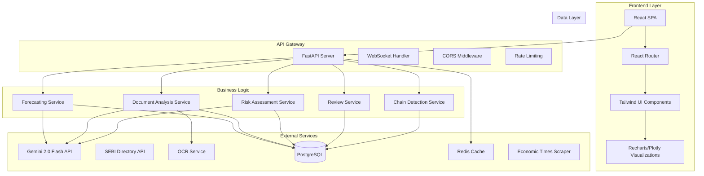
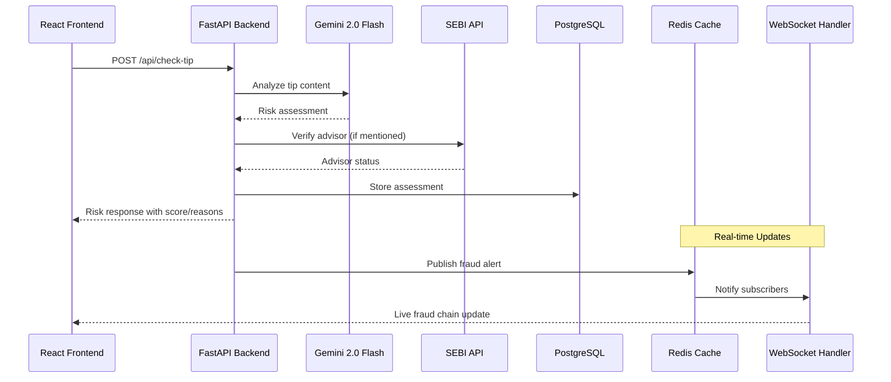

# Design Document

## Overview

IRIS (Intelligent Risk & Investigation System) is a full-stack RegTech platform built with a modern microservices-oriented architecture. The system uses React for the frontend, FastAPI for the backend, PostgreSQL for data persistence, and integrates with Gemini 2.0 Flash for AI-powered analysis. The platform is designed to handle both real-time user interactions and batch processing for regulatory monitoring.

The system serves two distinct user personas:
- **Investors**: Need quick, intuitive tools to verify tips, advisors, and documents
- **Regulators**: Require comprehensive dashboards, analytics, and review capabilities

## Architecture

### High-Level Architecture



### Technology Stack

**Frontend:**
- React 18 with TypeScript
- Vite for build tooling
- React Router for navigation
- Tailwind CSS for styling
- Recharts for data visualization
- React Query for API state management

**Backend:**
- FastAPI with Python 3.11+
- Pydantic for data validation
- SQLAlchemy for ORM
- Alembic for database migrations
- Redis for caching and session management
- Celery for background tasks (optional)

**AI & External Services:**
- Google Gemini 2.0 Flash API
- Tesseract/EasyOCR for document processing
- SEBI API integration
- FMP (Financial Modeling Prep) API for market data and financial news
- Google Trends API for search trend analysis
- Economic Times web scraping for Indian financial news
- BeautifulSoup/Scrapy for web scraping infrastructure

**Infrastructure:**
- PostgreSQL 15+ for primary database
- Redis for caching
- Docker for containerization
- HTTPS/TLS for security

## Frontend-Backend Communication Layer

### Communication Architecture



### Data Flow Patterns

**Request-Response Flow:**
- React components use React Query for API state management
- Axios interceptors handle authentication and error responses
- FastAPI orchestrates calls to external services (Gemini, SEBI, OCR)
- Responses cached in Redis for performance optimization

**Real-time Communication:**
- WebSocket connection at `/ws/alerts` for live updates
- Redis Pub/Sub for scalable real-time notifications
- Frontend subscribes to fraud chain updates, heatmap changes, and high-risk alerts
- Automatic reconnection handling for WebSocket failures

**Authentication Flow:**
- JWT tokens for role-based access control
- Refresh token rotation for security
- Role-based menu rendering and API access

## Components and Interfaces

### Frontend Components

#### Enhanced Navigation Component
```typescript
interface NavBarProps {
  user?: User;
  notifications?: Notification[];
  onLogout: () => void;
}

interface User {
  id: string;
  role: 'investor' | 'regulator' | 'admin';
  name: string;
  avatar?: string;
}

interface NavItem {
  label: string;
  path: string;
  icon?: ReactNode;
  roles?: ('investor' | 'regulator' | 'admin')[];
  badge?: number; // For notification counts
}

interface Notification {
  id: string;
  type: 'fraud_alert' | 'chain_update' | 'review_required';
  title: string;
  message: string;
  timestamp: Date;
  read: boolean;
  priority: 'low' | 'medium' | 'high';
}
```

#### Risk Assessment Components
```typescript
interface RiskBadgeProps {
  level: 'Low' | 'Medium' | 'High';
  score: number;
  reasons: string[];
  className?: string;
}

interface TipAnalysisFormProps {
  onSubmit: (message: string) => Promise<void>;
  loading: boolean;
}
```

#### Enhanced Dashboard Components
```typescript
interface HeatmapProps {
  data: HeatmapData[];
  dimension: 'sector' | 'region';
  onCellClick: (key: string) => void;
  confidenceOverlay?: boolean; // Show AI confidence levels
  newsOverlay?: boolean; // Show news indicators
  newsData?: NewsIndicator[];
}

interface DataIndicator {
  sector?: string;
  region?: string;
  source: 'fmp' | 'google_trends' | 'economic_times';
  dataCount: number;
  relevanceScore: number; // 0-100
  sentiment: 'positive' | 'negative' | 'neutral';
  summary: string;
  details: FMPData | GoogleTrendsData | EconomicTimesData;
}

interface FMPData {
  stockAlerts: StockAlert[];
  marketNews: MarketNews[];
  financialEvents: FinancialEvent[];
}

interface GoogleTrendsData {
  trendingKeywords: TrendKeyword[];
  regionalSpikes: RegionalSpike[];
  fraudSearchVolume: number;
}

interface EconomicTimesData {
  articles: NewsArticle[];
  regulatoryUpdates: RegulatoryUpdate[];
  marketAnalysis: MarketAnalysis[];
}

interface FraudChainGraphProps {
  nodes: ChainNode[];
  edges: ChainEdge[];
  onNodeClick: (nodeId: string) => void;
  animationEnabled?: boolean; // Animate fraud lifecycle
  timelineMode?: boolean; // Show temporal progression
  exportOptions?: {
    pdf: boolean;
    csv: boolean;
    json: boolean;
  };
}

interface ForecastVisualizationProps {
  forecasts: EnhancedForecast[];
  showConfidenceIntervals: boolean;
  explainableFactors: boolean;
}

interface EnhancedForecast {
  key: string;
  riskScore: number;
  confidenceInterval: [number, number]; // [min, max]
  contributingFactors: {
    factor: string;
    weight: number;
    explanation: string;
  }[];
  rationale: string;
}
```

### Backend Service Interfaces

#### Risk Assessment Service
```python
class RiskAssessmentService:
    async def analyze_tip(self, message: str, context: dict) -> RiskAssessment:
        """Analyze investment tip using Gemini AI"""
        
    async def detect_stock_symbols(self, text: str) -> List[str]:
        """Extract stock symbols from text"""
        
    async def check_advisor_mention(self, text: str) -> Optional[AdvisorInfo]:
        """Check if text mentions registered advisors"""
```

#### Document Analysis Service
```python
class DocumentAnalysisService:
    async def analyze_pdf(self, file_path: str) -> PDFAnalysisResult:
        """Comprehensive PDF authenticity analysis"""
        
    async def extract_text_ocr(self, file_path: str) -> str:
        """Extract text using OCR"""
        
    async def detect_anomalies(self, pdf_metadata: dict, ocr_text: str) -> List[Anomaly]:
        """Detect document anomalies using heuristics and AI"""
```

#### Multi-Source Data Integration Service
```python
class FMPIntegrationService:
    async def fetch_market_data(self, symbols: List[str]) -> List[StockData]:
        """Fetch real-time stock prices and market data from FMP API"""
        
    async def fetch_financial_news(self, sectors: List[str]) -> List[MarketNews]:
        """Fetch financial news from FMP API"""
        
    async def detect_unusual_activity(self, stock_data: List[StockData]) -> List[StockAlert]:
        """Detect unusual trading patterns that might indicate fraud"""
        
    async def get_company_financials(self, symbol: str) -> CompanyFinancials:
        """Fetch company financial statements for fraud analysis"""

class GoogleTrendsService:
    async def fetch_fraud_trends(self, regions: List[str], timeframe: str = "7d") -> List[TrendData]:
        """Fetch Google Trends data for fraud-related keywords by region"""
        
    async def analyze_search_spikes(self, trend_data: List[TrendData]) -> List[RegionalSpike]:
        """Identify regions with unusual spikes in fraud-related searches"""
        
    async def correlate_trends_with_fraud(self, trends: List[TrendData], fraud_cases: List[dict]) -> List[TrendCorrelation]:
        """Correlate search trends with actual fraud case patterns"""

class EconomicTimesScrapingService:
    async def scrape_latest_news(self, categories: List[str] = ["markets", "policy"]) -> List[NewsArticle]:
        """Scrape latest financial news from Economic Times"""
        
    async def monitor_regulatory_updates(self) -> List[RegulatoryUpdate]:
        """Monitor SEBI and RBI updates from Economic Times"""
        
    async def extract_market_sentiment(self, articles: List[NewsArticle]) -> MarketSentiment:
        """Extract overall market sentiment from scraped articles"""

class DataAggregationService:
    async def score_fraud_relevance(self, data_item: Union[NewsArticle, StockData, TrendData]) -> float:
        """Use AI to score data relevance to fraud detection (0-100)"""
        
    async def generate_consolidated_indicators(self, heatmap_data: List[dict]) -> List[DataIndicator]:
        """Generate multi-source overlay indicators for heatmap visualization"""
        
    async def correlate_multi_source_data(self, fmp_data: List[dict], trends_data: List[dict], news_data: List[dict]) -> List[CrossSourceCorrelation]:
        """Correlate data across FMP, Google Trends, and Economic Times"""

#### Enhanced Forecasting Service
```python
class ForecastingService:
    async def generate_forecast(self, dimension: str, period: str) -> List[EnhancedForecastItem]:
        """Generate AI-powered risk forecasts with explainability"""
        
    async def calculate_trend_features(self, historical_data: List[dict]) -> dict:
        """Calculate time-series features for forecasting"""
        
    async def generate_confidence_intervals(self, base_forecast: dict) -> Tuple[float, float]:
        """Calculate confidence intervals for forecasts"""
        
    async def explain_forecast_factors(self, forecast_data: dict) -> List[FactorExplanation]:
        """Generate explainable factors contributing to forecast"""
        
    async def detect_fraud_dna_patterns(self, text_samples: List[str]) -> List[FraudPattern]:
        """Identify recurring fraud patterns across platforms"""
```

### API Endpoints Design

#### Core Endpoints
```python
# Risk Assessment
POST /api/check-tip
GET /api/verify-advisor
POST /api/check-pdf

# Regulatory Dashboard
GET /api/fraud-heatmap
GET /api/forecast
GET /api/fraud-chain/{id}

# Multi-Source Data Integration
GET /api/data/indicators
GET /api/fmp/market-data
GET /api/fmp/stock-alerts
GET /api/trends/fraud-keywords
GET /api/trends/regional-spikes
GET /api/economic-times/latest-news
GET /api/economic-times/regulatory-updates
GET /api/data/correlations

# Human-in-the-Loop
GET /api/review-queue
POST /api/review
GET /api/audit-log

# Real-time
WebSocket /ws/alerts
```

#### Request/Response Contracts
```python
class CheckTipRequest(BaseModel):
    message: str
    source: Optional[str] = "manual"
    submitter_id: Optional[str] = None

class RiskAssessmentResponse(BaseModel):
    level: Literal['Low', 'Medium', 'High']
    score: int  # 0-100
    reasons: List[str]
    stock_symbols: List[str]
    advisor: Optional[AdvisorInfo]
    timestamp: datetime
    assessment_id: str
    confidence: float  # AI confidence score
```

## Data Models

### Core Entities

#### Tips and Assessments
```sql
CREATE TABLE tips (
    id UUID PRIMARY KEY DEFAULT gen_random_uuid(),
    message TEXT NOT NULL,
    source VARCHAR(50) DEFAULT 'manual',
    submitter_id VARCHAR(100),
    created_at TIMESTAMP DEFAULT NOW(),
    updated_at TIMESTAMP DEFAULT NOW()
);

CREATE TABLE assessments (
    id UUID PRIMARY KEY DEFAULT gen_random_uuid(),
    tip_id UUID REFERENCES tips(id),
    level VARCHAR(10) NOT NULL CHECK (level IN ('Low', 'Medium', 'High')),
    score INTEGER NOT NULL CHECK (score >= 0 AND score <= 100),
    reasons JSONB NOT NULL,
    stock_symbols JSONB DEFAULT '[]',
    advisor_info JSONB,
    gemini_raw JSONB,
    confidence FLOAT,
    created_at TIMESTAMP DEFAULT NOW()
);
```

#### Document Analysis
```sql
CREATE TABLE pdf_checks (
    id UUID PRIMARY KEY DEFAULT gen_random_uuid(),
    file_hash VARCHAR(64) UNIQUE NOT NULL,
    filename VARCHAR(255) NOT NULL,
    file_size INTEGER,
    ocr_text TEXT,
    anomalies JSONB DEFAULT '[]',
    score INTEGER CHECK (score >= 0 AND score <= 100),
    is_likely_fake BOOLEAN,
    processing_time_ms INTEGER,
    created_at TIMESTAMP DEFAULT NOW()
);
```

#### Fraud Chain Modeling
```sql
CREATE TABLE fraud_chains (
    id UUID PRIMARY KEY DEFAULT gen_random_uuid(),
    name VARCHAR(255),
    description TEXT,
    status VARCHAR(50) DEFAULT 'active',
    created_at TIMESTAMP DEFAULT NOW()
);

CREATE TABLE fraud_chain_nodes (
    id UUID PRIMARY KEY DEFAULT gen_random_uuid(),
    chain_id UUID REFERENCES fraud_chains(id),
    node_type VARCHAR(50) NOT NULL, -- 'tip', 'document', 'stock', 'complaint'
    reference_id UUID NOT NULL, -- points to tips.id, pdf_checks.id, etc.
    label VARCHAR(255),
    metadata JSONB DEFAULT '{}',
    position_x FLOAT,
    position_y FLOAT,
    created_at TIMESTAMP DEFAULT NOW()
);

CREATE TABLE fraud_chain_edges (
    id UUID PRIMARY KEY DEFAULT gen_random_uuid(),
    chain_id UUID REFERENCES fraud_chains(id),
    from_node UUID REFERENCES fraud_chain_nodes(id),
    to_node UUID REFERENCES fraud_chain_nodes(id),
    relationship_type VARCHAR(100), -- 'references', 'leads_to', 'mentions'
    confidence FLOAT DEFAULT 1.0,
    created_at TIMESTAMP DEFAULT NOW()
);
```

#### Forecasting and Analytics
```sql
CREATE TABLE forecasts (
    id UUID PRIMARY KEY DEFAULT gen_random_uuid(),
    period VARCHAR(7) NOT NULL, -- YYYY-MM format
    dimension VARCHAR(20) NOT NULL, -- 'sector' or 'region'
    key VARCHAR(100) NOT NULL, -- sector name or region name
    risk_score INTEGER CHECK (risk_score >= 0 AND risk_score <= 100),
    rationale TEXT,
    features JSONB, -- time-series features used
    model_version VARCHAR(50),
    created_at TIMESTAMP DEFAULT NOW(),
    UNIQUE(period, dimension, key)
);

CREATE TABLE heatmap_buckets (
    id UUID PRIMARY KEY DEFAULT gen_random_uuid(),
    dimension VARCHAR(20) NOT NULL,
    key VARCHAR(100) NOT NULL,
    from_date DATE NOT NULL,
    to_date DATE NOT NULL,
    total_count INTEGER DEFAULT 0,
    high_risk_count INTEGER DEFAULT 0,
    medium_risk_count INTEGER DEFAULT 0,
    low_risk_count INTEGER DEFAULT 0,
    last_updated TIMESTAMP DEFAULT NOW(),
    UNIQUE(dimension, key, from_date, to_date)
);
```

#### Enhanced Human-in-the-Loop Reviews
```sql
CREATE TABLE reviews (
    id UUID PRIMARY KEY DEFAULT gen_random_uuid(),
    entity_id UUID NOT NULL,
    entity_type VARCHAR(50) NOT NULL, -- 'assessment', 'pdf_check', 'fraud_chain'
    reviewer_id VARCHAR(100) NOT NULL,
    decision VARCHAR(50) NOT NULL, -- 'approve', 'override', 'needs_more_info'
    notes TEXT,
    original_ai_decision JSONB,
    human_decision JSONB,
    ai_confidence FLOAT, -- Store AI confidence for active learning
    feedback_quality JSONB, -- Track feedback quality for model improvement
    created_at TIMESTAMP DEFAULT NOW()
);

-- Active Learning and Model Improvement
CREATE TABLE model_feedback (
    id UUID PRIMARY KEY DEFAULT gen_random_uuid(),
    review_id UUID REFERENCES reviews(id),
    feedback_type VARCHAR(50), -- 'correction', 'confirmation', 'enhancement'
    model_version VARCHAR(50),
    improvement_suggestions JSONB,
    created_at TIMESTAMP DEFAULT NOW()
);

-- Fraud DNA Patterns
CREATE TABLE fraud_patterns (
    id UUID PRIMARY KEY DEFAULT gen_random_uuid(),
    pattern_hash VARCHAR(64) UNIQUE NOT NULL,
    pattern_type VARCHAR(50), -- 'text_similarity', 'image_hash', 'behavioral'
    pattern_data JSONB,
    first_seen TIMESTAMP DEFAULT NOW(),
    last_seen TIMESTAMP DEFAULT NOW(),
    occurrence_count INTEGER DEFAULT 1,
    platforms JSONB DEFAULT '[]', -- ['telegram', 'whatsapp', 'twitter']
    confidence_score FLOAT
);

-- Multi-Source Data Integration
CREATE TABLE fmp_market_data (
    id UUID PRIMARY KEY DEFAULT gen_random_uuid(),
    symbol VARCHAR(20) NOT NULL,
    price DECIMAL(10,2),
    change_percent DECIMAL(5,2),
    volume BIGINT,
    market_cap BIGINT,
    unusual_activity BOOLEAN DEFAULT FALSE,
    fraud_relevance_score FLOAT,
    data_timestamp TIMESTAMP NOT NULL,
    created_at TIMESTAMP DEFAULT NOW()
);

CREATE TABLE google_trends_data (
    id UUID PRIMARY KEY DEFAULT gen_random_uuid(),
    keyword VARCHAR(255) NOT NULL,
    region VARCHAR(100),
    search_volume INTEGER,
    trend_direction VARCHAR(20), -- 'rising', 'falling', 'stable'
    spike_detected BOOLEAN DEFAULT FALSE,
    fraud_correlation_score FLOAT,
    timeframe VARCHAR(20), -- '1h', '1d', '7d', '30d'
    data_timestamp TIMESTAMP NOT NULL,
    created_at TIMESTAMP DEFAULT NOW()
);

CREATE TABLE economic_times_articles (
    id UUID PRIMARY KEY DEFAULT gen_random_uuid(),
    article_url VARCHAR(500) UNIQUE NOT NULL,
    title TEXT NOT NULL,
    content TEXT,
    category VARCHAR(100), -- 'markets', 'policy', 'banking'
    author VARCHAR(255),
    published_at TIMESTAMP,
    scraped_at TIMESTAMP DEFAULT NOW(),
    fraud_relevance_score FLOAT,
    sentiment VARCHAR(20),
    regulatory_mentions JSONB DEFAULT '[]', -- ['SEBI', 'RBI', 'IRDAI']
    stock_mentions JSONB DEFAULT '[]',
    created_at TIMESTAMP DEFAULT NOW()
);

CREATE TABLE cross_source_correlations (
    id UUID PRIMARY KEY DEFAULT gen_random_uuid(),
    correlation_type VARCHAR(50), -- 'market_news_trend', 'regulatory_stock_spike'
    source_1 VARCHAR(50), -- 'fmp', 'google_trends', 'economic_times'
    source_1_id UUID,
    source_2 VARCHAR(50),
    source_2_id UUID,
    correlation_strength FLOAT, -- 0-1
    fraud_implication TEXT,
    analysis_summary TEXT,
    created_at TIMESTAMP DEFAULT NOW()
);

CREATE TABLE data_indicators (
    id UUID PRIMARY KEY DEFAULT gen_random_uuid(),
    heatmap_sector VARCHAR(100),
    heatmap_region VARCHAR(100),
    indicator_type VARCHAR(50), -- 'fmp_alert', 'trend_spike', 'news_sentiment'
    source VARCHAR(50),
    relevance_score FLOAT,
    summary TEXT,
    details JSONB,
    active BOOLEAN DEFAULT TRUE,
    expires_at TIMESTAMP,
    created_at TIMESTAMP DEFAULT NOW()
);
```

### Database Indexes and Performance
```sql
-- Performance indexes
CREATE INDEX idx_assessments_created_at ON assessments(created_at DESC);
CREATE INDEX idx_assessments_score ON assessments(score DESC);
CREATE INDEX idx_assessments_level ON assessments(level);
CREATE INDEX idx_pdf_checks_file_hash ON pdf_checks(file_hash);
CREATE INDEX idx_fraud_chain_nodes_chain_id ON fraud_chain_nodes(chain_id);
CREATE INDEX idx_fraud_chain_nodes_type ON fraud_chain_nodes(node_type);
CREATE INDEX idx_heatmap_buckets_dimension_key ON heatmap_buckets(dimension, key);
CREATE INDEX idx_reviews_entity ON reviews(entity_type, entity_id);
CREATE INDEX idx_reviews_reviewer ON reviews(reviewer_id, created_at DESC);
```

## Error Handling

### Error Response Format
```python
class ErrorResponse(BaseModel):
    error: ErrorDetail

class ErrorDetail(BaseModel):
    code: str
    message: str
    details: Optional[dict] = None
    request_id: Optional[str] = None
```

### Error Categories and Handling

#### Client Errors (4xx)
- **400 Bad Request**: Invalid input data, malformed requests
- **401 Unauthorized**: Missing or invalid authentication
- **403 Forbidden**: Insufficient permissions for role-based access
- **404 Not Found**: Resource not found
- **413 Payload Too Large**: File upload size exceeded
- **429 Too Many Requests**: Rate limit exceeded

#### Server Errors (5xx)
- **500 Internal Server Error**: Unexpected server errors
- **502 Bad Gateway**: External service (Gemini API) unavailable
- **503 Service Unavailable**: Database connection issues
- **504 Gateway Timeout**: External API timeout

#### Custom Error Handling
```python
@app.exception_handler(ValidationError)
async def validation_exception_handler(request: Request, exc: ValidationError):
    return JSONResponse(
        status_code=400,
        content={
            "error": {
                "code": "VALIDATION_ERROR",
                "message": "Invalid input data",
                "details": exc.errors(),
                "request_id": request.headers.get("X-Request-ID")
            }
        }
    )
```

### Retry Logic and Circuit Breakers
```python
class GeminiService:
    def __init__(self):
        self.circuit_breaker = CircuitBreaker(
            failure_threshold=5,
            recovery_timeout=30,
            expected_exception=httpx.RequestError
        )
    
    @retry(stop=stop_after_attempt(3), wait=wait_exponential(multiplier=1, min=4, max=10))
    async def analyze_with_gemini(self, prompt: str) -> dict:
        """Call Gemini API with retry logic and circuit breaker"""
```

## Testing Strategy

### Unit Testing
- **Backend**: pytest with FastAPI test client
- **Frontend**: Jest and React Testing Library
- **Coverage Target**: 80%+ for critical business logic

### Integration Testing
- **API Integration**: Test all endpoints with real database
- **External Service Mocking**: Mock Gemini API for consistent testing
- **Database Testing**: Use test database with transaction rollback

### End-to-End Testing
- **User Flows**: Playwright for critical user journeys
- **Cross-browser Testing**: Chrome, Firefox, Safari
- **Mobile Responsiveness**: Test on various screen sizes

### Performance Testing
- **Load Testing**: Artillery.js for API endpoints
- **Database Performance**: Query optimization and index effectiveness
- **Frontend Performance**: Lighthouse CI for performance metrics

### Security Testing
- **OWASP ZAP**: Automated security scanning
- **Input Validation**: SQL injection and XSS prevention
- **Authentication Testing**: JWT token validation and expiration

### Test Data Management
```python
# Fixtures for consistent test data
@pytest.fixture
def sample_tip():
    return {
        "message": "Buy XYZ stock now! Guaranteed 500% returns in 1 week!",
        "source": "telegram"
    }

@pytest.fixture
def sample_assessment():
    return {
        "level": "High",
        "score": 95,
        "reasons": ["Unrealistic return promises", "Urgency pressure", "Guaranteed returns claim"],
        "stock_symbols": ["XYZ"]
    }
```

### Continuous Integration
```yaml
# GitHub Actions workflow
name: CI/CD Pipeline
on: [push, pull_request]
jobs:
  test:
    runs-on: ubuntu-latest
    services:
      postgres:
        image: postgres:15
        env:
          POSTGRES_PASSWORD: test
    steps:
      - uses: actions/checkout@v3
      - name: Run Backend Tests
        run: |
          pip install -r requirements.txt
          pytest --cov=app tests/
      - name: Run Frontend Tests
        run: |
          npm install
          npm run test:coverage
      - name: Security Scan
        run: |
          docker run -t owasp/zap2docker-stable zap-baseline.py -t http://localhost:8000
```

## Unique Features and Competitive Advantages

### Fraud DNA Fingerprinting
- **Pattern Recognition**: Hash-based identification of recurring scam patterns
- **Cross-Platform Correlation**: Detect same fraud schemes across Telegram, WhatsApp, Twitter
- **Behavioral Analysis**: Identify fraudster behavioral patterns and communication styles

### Explainable AI Forecasting
- **Factor Attribution**: Show which specific factors contribute to risk predictions
- **Confidence Intervals**: Provide uncertainty ranges (e.g., "70-85% likelihood")
- **Temporal Analysis**: Track how risk factors evolve over time

### Advanced Chain Visualization
- **Animated Lifecycle**: Show fraud progression from tip to investor loss
- **Time Dimension**: Visualize fraud evolution across weeks/months
- **Interactive Exploration**: Drill down into any chain component
- **Export Capabilities**: Generate case reports in PDF/CSV formats

### Multi-language Support
- **Regional Languages**: Hindi, Tamil, Bengali, Gujarati support via Gemini
- **Cultural Context**: Understand region-specific fraud tactics
- **Localized Risk Indicators**: Culturally appropriate warning messages

## Deployment and Scaling Architecture

### Container Orchestration
```yaml
# docker-compose.yml structure
services:
  frontend:
    image: iris-frontend:latest
    ports: ["3000:3000"]
  
  backend:
    image: iris-backend:latest
    ports: ["8000:8000"]
    environment:
      - DATABASE_URL=postgresql://...
      - GEMINI_API_KEY=${GEMINI_API_KEY}
  
  postgres:
    image: postgres:15
    volumes: ["postgres_data:/var/lib/postgresql/data"]
  
  redis:
    image: redis:7-alpine
    
  nginx:
    image: nginx:alpine
    ports: ["80:80", "443:443"]
    volumes: ["./nginx.conf:/etc/nginx/nginx.conf"]
```

### Production Infrastructure
- **Load Balancing**: NGINX/Traefik for request distribution
- **Database**: PostgreSQL with read replicas for scaling
- **Caching**: Redis cluster for session management and real-time data
- **Monitoring**: Grafana + Prometheus for system observability
- **Security**: SSL/TLS termination, rate limiting, DDoS protection

### Regulatory API Integration
```python
# SEBI Integration Endpoint
@app.get("/api/regulatory/export")
async def export_for_sebi(
    format: str = "json",
    date_range: DateRange = Depends(),
    case_types: List[str] = Query(default=[])
) -> Union[JSONResponse, StreamingResponse]:
    """Export IRIS findings in SEBI-compatible format"""
```

This enhanced design provides a robust, scalable foundation for the IRIS RegTech platform with unique competitive advantages, comprehensive real-time capabilities, and regulatory-grade reliability.